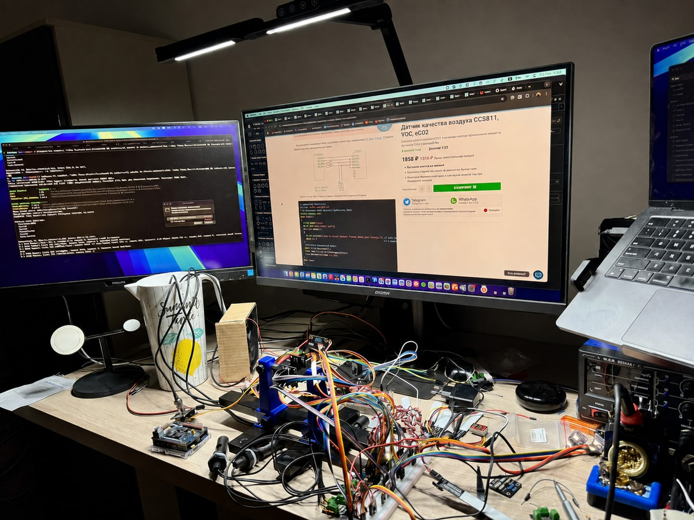
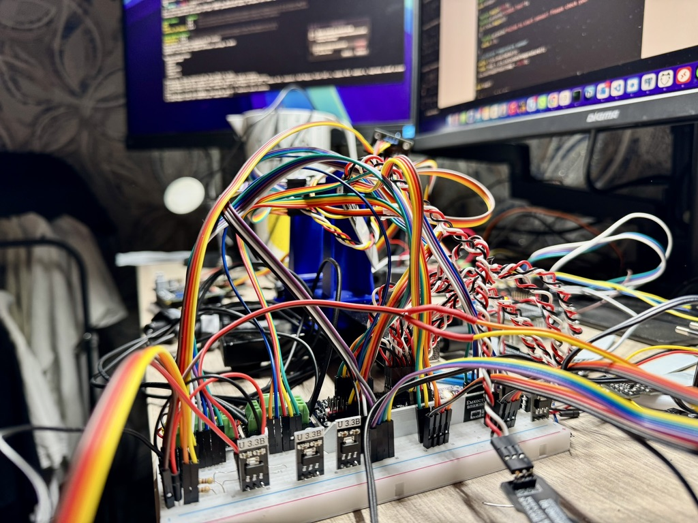
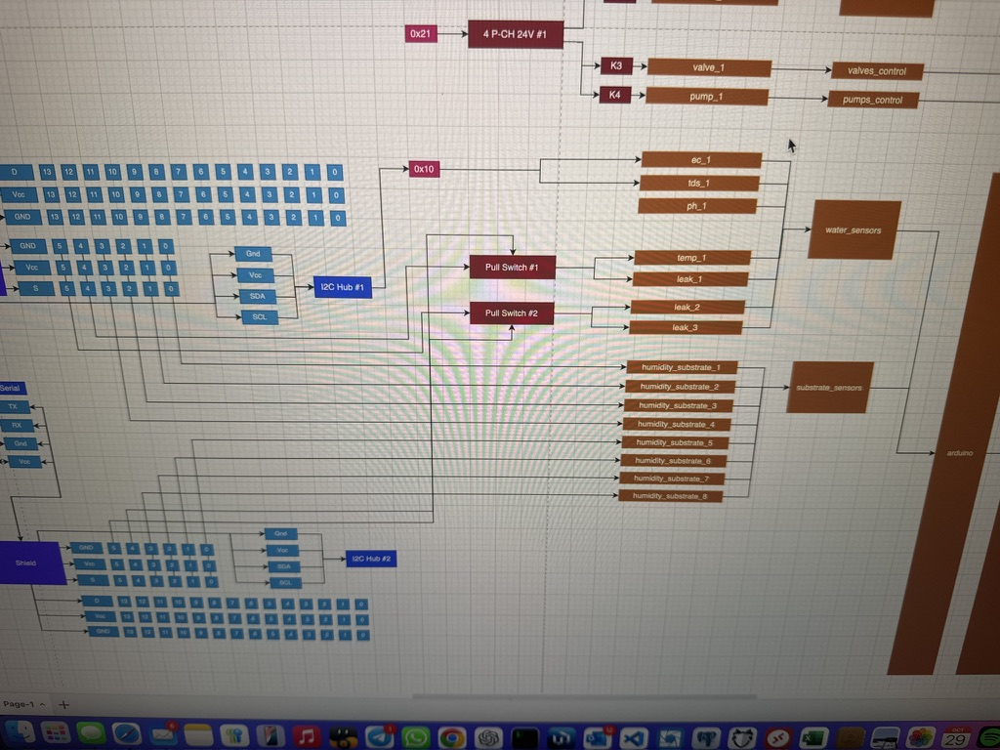
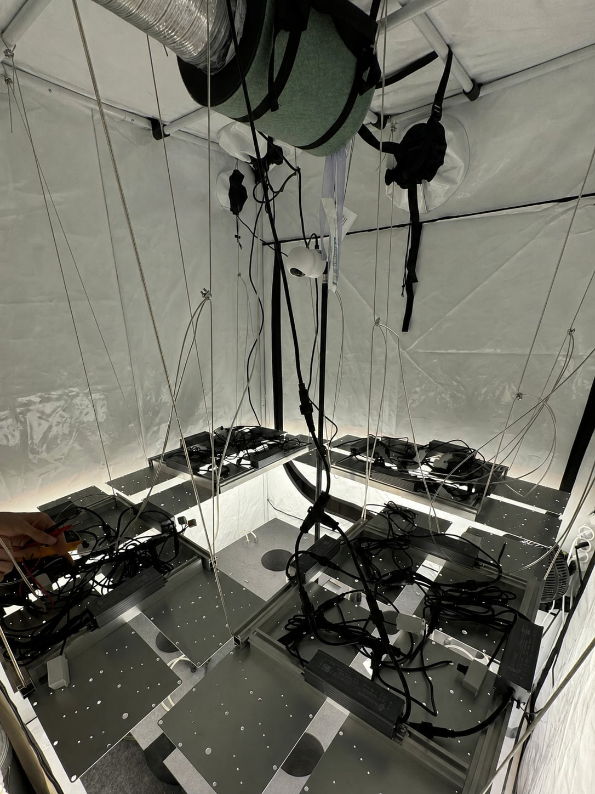
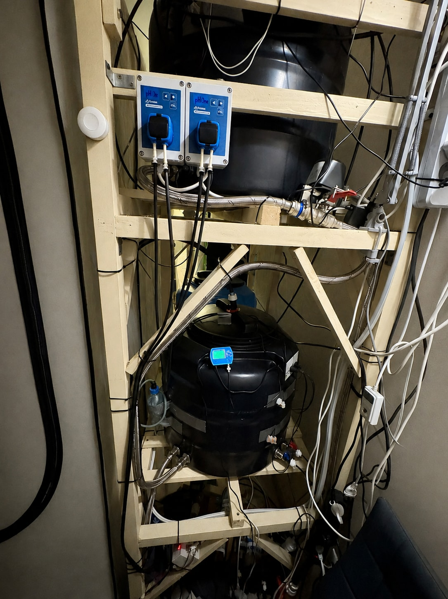
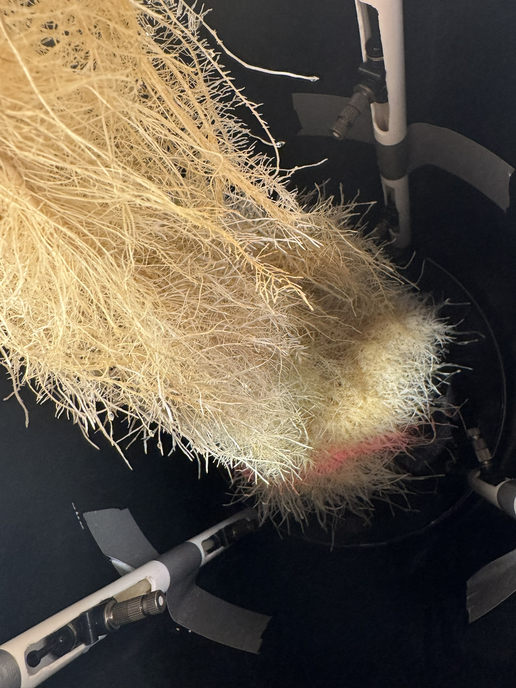

# Aeroponics sensor firmware — historical R&D prototypes

Five archived firmware prototypes from a personal aeroponics lab in 2024, covering light sensing, pH, substrate moisture, EC/TDS and serial relay control. These are experimental versions, not a finished solution or a firmware release. They are retained to show the progression of the hardware and integration work, with their original limitations.

## Prototype inventory

Dates below identify the selected historical source revisions, not new releases. Each row is a separate sketch; do not combine their `.ino` files in one Arduino sketch directory.

| Prototype | Source revision date | Included behavior | Important limitation |
| --- | --- | --- | --- |
| [Uno light telemetry](uno/uno.ino) | 2024-11-10 | Four TCS34725 sensors, RGB/clear readings, derived lux/color temperature, JSON/MQTT and sensor-setting handler | Missing modified sensor library, commented-out bus declarations and an unregistered MQTT callback |
| [TCS34725 serial](variants/tcs34725_serial/tcs34725_serial.ino) | 2024-11-10 | Four software-I2C buses with RGB/clear readings printed to Serial | No MQTT; requires the missing modified `Adafruit_TCS34725_Soft.h` library |
| [pH and relay serial](variants/ph_relay_serial/ph_relay_serial.ino) | 2024-10-28 | I2C pH readings and four-channel relay commands from Serial | No MQTT; relay polarity and startup behavior are unverified |
| [EC/TDS and relay serial](variants/ec_tds_relay_serial/ec_tds_relay_serial.ino) | 2024-10-28 | EC/TDS readings, relay commands and a received pH value over Serial1 | Wi-Fi/MQTT connection setup only; no MQTT telemetry publication |
| [pH and moisture MQTT](variants/ph_moisture_mqtt/ph_moisture_mqtt.ino) | 2024-09-29 | pH and two analog moisture inputs, averaging and JSON/MQTT publication | Historical calibration/conversion assumptions, timing-comment inconsistencies and an hourly device reset |

Depending on the sketch, dependencies include `Wire`, `SoftwareWire`, `WiFiS3`, `ArduinoMqttClient`, `ArduinoJson`, the iarduino pH/TDS/relay libraries, `iarduino_I2C_Software` and modified Adafruit TCS34725 libraries. External libraries are not bundled. Wi-Fi sketches use the Uno R4 WiFi `WiFiS3` stack; compatibility of the other prototypes must be reviewed separately.

Related work: [Python controllers and MQTT integration](https://github.com/pilprod/aeroponics-iot-control) · [Home Aeroponics portfolio](https://papou.work/portfolio.html#home).

## Lab gallery

### Electronics and integration

Photographs from the original personal R&D lab show component assembly, wiring and the wider installation. They provide project context, not verification that this archived firmware builds or operates correctly.

Five photographs have AI-retouched backgrounds or identifying areas: the electronics workbench, power shield, lighting and ventilation, water system, and enclosure camera.

**Electronics workbench** — component wiring and soldering during sensor and controller prototyping.

**Breadboard prototype** — breadboard-mounted sensor modules and jumper wiring during controller prototyping. Full original frame, without cropping or AI redraw. Click to open the 1024 × 768 photograph.

**Power shield** — a commercial board used in the electronics assembly.

**Wiring diagram** — connections documented during design of the wider lab system.

Wider lab: monitoring, installation and root-zone observations

### Monitoring and installation

These images document the surrounding Home Assistant and physical lab environment. The complete installation and its control logic are not included in this firmware snapshot.

**Home Assistant dashboard** — the lab's monitoring and control interface.

<table>
  <tr>
    <td width="50%"></td>
    <td width="50%"></td>
  </tr>
  <tr>
    <td><strong>Lighting and ventilation</strong> Enclosure, suspended fixtures and wiring.</td>
    <td><strong>Water system</strong> Reservoirs, pumps, valves and circulation plumbing.</td>
  </tr>
</table>

**Enclosure camera** — camera placement within the installation.

### Root-zone observations

**Root chamber** — roots, chamber and tubing in the experimental installation.

## Configuration

Open one sketch directory at a time. For `uno`, `variants/ec_tds_relay_serial` or `variants/ph_moisture_mqtt`, copy that directory's `arduino_secrets.example.h` to its ignored `arduino_secrets.h` and provide local Wi-Fi and broker settings. The two Serial-only prototypes do not need a network configuration header.

Do not commit real credentials. The placeholder header does not add MQTT authentication or TLS. Review the limitations below before attempting compilation or connecting hardware.

## Known archival limitations

- **Uno light telemetry:** calls to `myWire1`–`myWire4` remain while their declarations are commented out. The modified `Adafruit_TCS34725softi2c` dependency is missing. `messageReceived` is defined but not registered as an MQTT callback. Commented-out CCS811 code is not an implemented feature.
- **TCS34725 serial:** the separate modified `Adafruit_TCS34725_Soft.h` dependency is also missing. Readings are sent to Serial only; the commented pH/relay experiment is not active in this variant.
- **pH and relay serial:** relay states and command handling are preserved, including startup behavior. Electrical polarity, interlocks and safe actuator operation have not been verified.
- **EC/TDS and relay serial:** connecting to MQTT does not publish sensor readings. The local pH sensor is commented out; the sketch instead reads a pH value from Serial1. Serial command parsing and actuator behavior remain unverified.
- **pH and moisture MQTT:** analog conversion constants, averaging, startup publication delay and the hourly reset are unchanged. Some source comments do not match the buffer sizes or timing constants. No calibration or measurement-accuracy claim is made.

These issues are preserved rather than silently repaired. Compilation, hardware operation, calibration and safety have not been tested for this snapshot. MQTT transport/security and command handling require review before real use. The gallery is not evidence of successful execution of any particular archived version.

See [SOURCE.md](SOURCE.md) for provenance. The original repository is retained; no new license grant is added.
